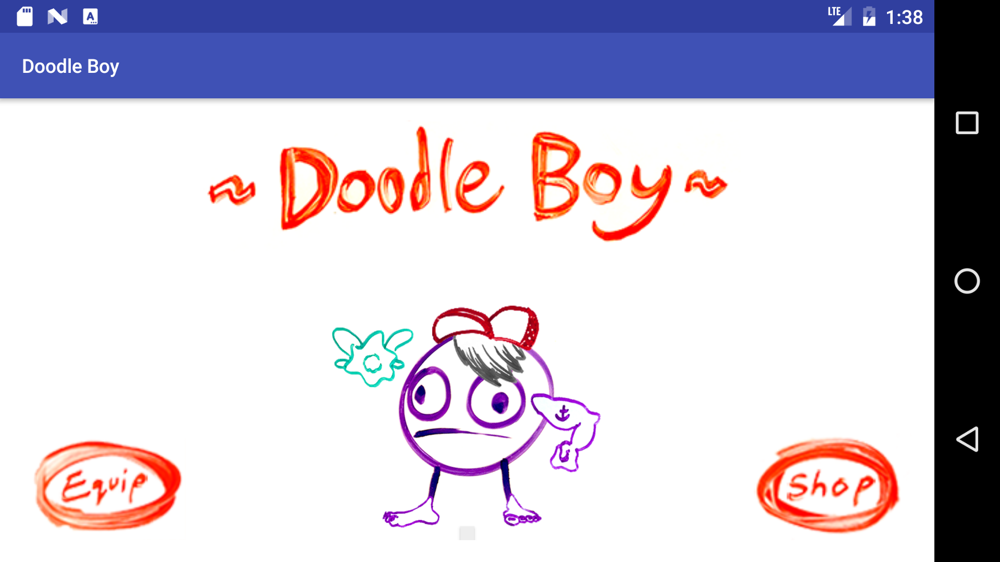
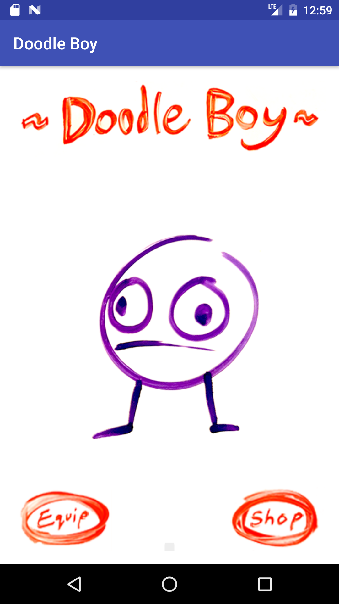
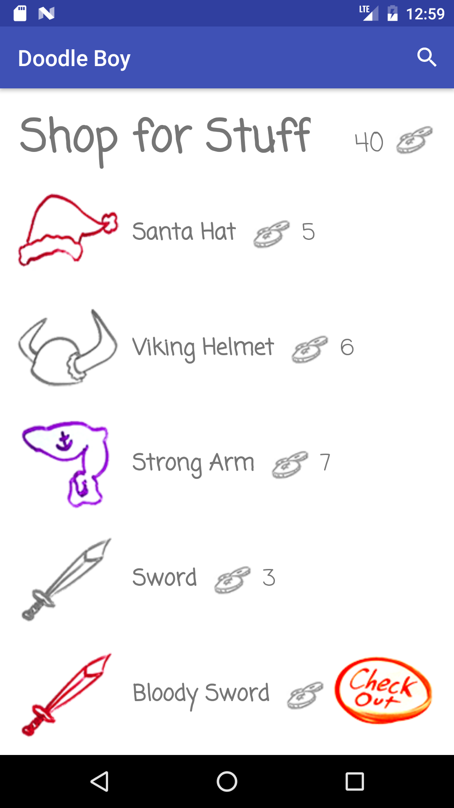
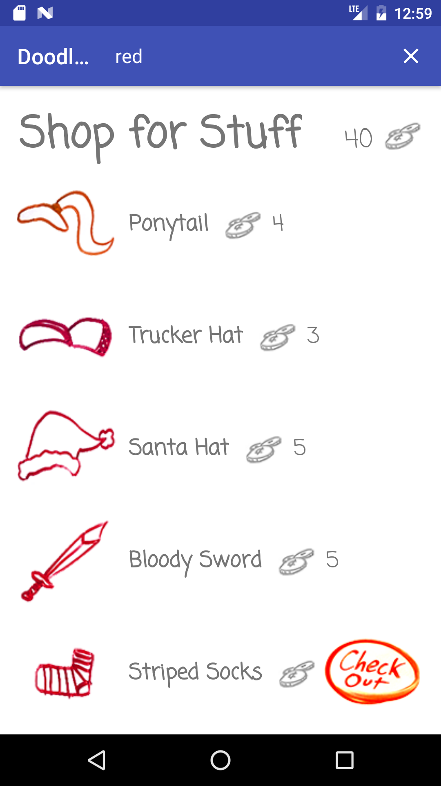
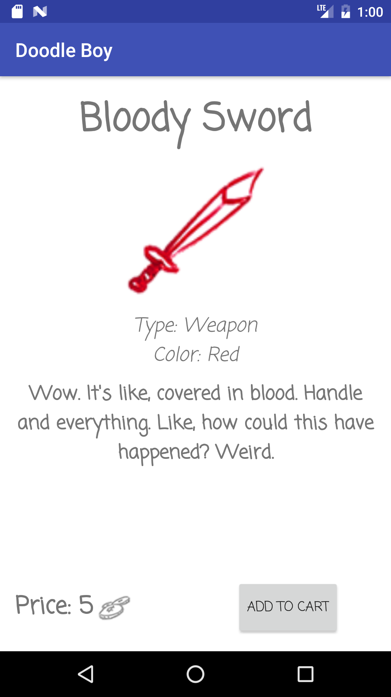
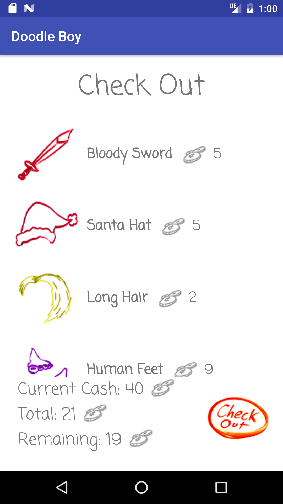

 
###Features
##Doodle Boy

- He’s a doodle, and he’s **constantly** working out his legs with squats.
- The images of him loop infinitely.

##Shop

- Can scroll through a list of items to buy for doodle boy.
- Search by name, color, or type of item and filter the results.
- Can check out detailed descriptions of all the items.
- Can add items to a cart, and check out later.
- Make sure you have enough money! Doodle items ain’t cheap.
- Luckily you can remove items from your cart if you want.

##Equip

- Equip those items you bought.
- Allows for one hair, hat, weapon, shoes, and elemental each.
- Head back to the main screen and see your customized doodle boy!

##Restart Everything

- Button that repopulates your money and the entire database.
- Removes all equipped items and removes them from the equip screen.

   
  
  
  
  
  

####BUGS

- When searching for things, if you flip the orientation, the search closes and the list repopulates automatically.
- One time, the shop list went on infinitely with just emo hair over and over again. No idea why. It stopped when I re-installed the app, haven’t seen it since, but still.

